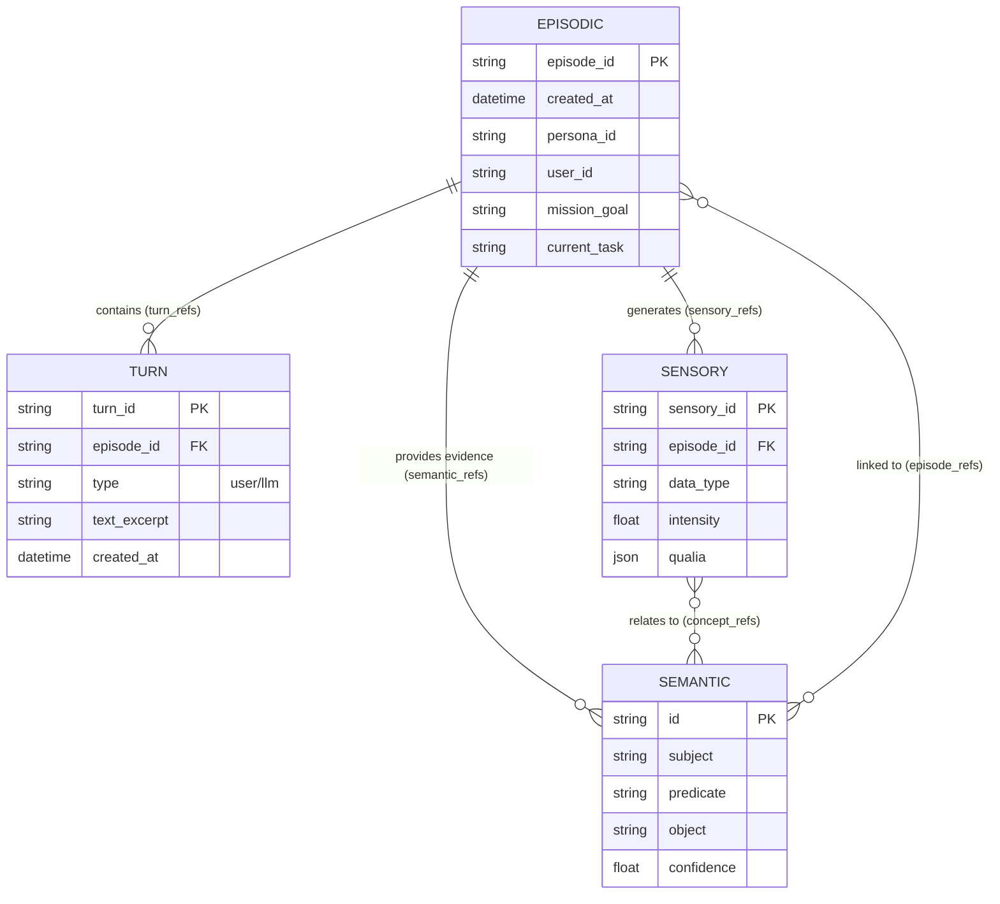

# EVA Genesis System Overview

> **Version:** v0.1.0 (Genesis)
> **Architecture:** Ports & Adapters (Hexagonal)
> **Approach:** Walking Skeleton
> **Last Updated:** 2026-01-29

---

## 1. Project Status

```
╔═══════════════════════════════════════════════════════════════════════════════╗
║                      EVA GENESIS PROJECT (E:\eva)                             ║
║                          Version: v0.1.0                                      ║
║                          Architecture: Ports & Adapters                       ║
║                          Approach: Walking Skeleton                           ║
╠═══════════════════════════════════════════════════════════════════════════════╣
║  Phase 0: Foundation    ████████████ 100% [DONE]                              ║
║  Phase 1: MSP Core      ████████████ 100% [DONE]                              ║
║  Phase 2: Orchestration ████████████ 100% [DONE]                              ║
║  Phase 3: Psychology    ░░░░░░░░░░░░   0% [PENDING]                           ║
║  Phase 4: Biology       ░░░░░░░░░░░░   0% [PENDING]                           ║
║  Phase 5: Perception    ░░░░░░░░░░░░   0% [PENDING]                           ║
║  Phase 6: Knowledge     ░░░░░░░░░░░░   0% [PENDING]                           ║
║  Phase 7: Integration   ░░░░░░░░░░░░   0% [PENDING]                           ║
╚═══════════════════════════════════════════════════════════════════════════════╝
```

---

## 2. Directory Structure

```
E:\eva\
│
├── contracts/                    # PORTS (Interfaces)
│   └── ports/
│       ├── i_bus.py              [DONE] Message bus interface
│       ├── i_memory_storage.py   [DONE] Memory storage interface
│       ├── i_state_provider.py   [DONE] State snapshot interface
│       └── i_resonance_encoder.py [DONE] Resonance encoding interface
│
├── adapters/                     # ADAPTERS (Implementations)
│   ├── simple_bus.py             [DONE] In-memory pub/sub
│   └── mocks/
│       ├── mock_state_providers.py  [DONE] MockPhysio, MockMatrix, MockQualia
│       └── mock_resonance_encoder.py [DONE] MockResonanceEncoder
│
├── msp/                          # MSP v0.4.1 (Memory System)
│   ├── msp_engine.py             [DONE] Unified orchestrator
│   ├── crosslink_manager.py      [DONE] Bidirectional linking
│   ├── schema/
│   │   ├── episodic.py           [DONE] Autobiographical memory (v3)
│   │   ├── semantic.py           [DONE] Factual knowledge (SPO)
│   │   ├── sensory.py            [DONE] Perceptual + Qualia
│   │   └── turn.py               [DONE] Turn wrapper
│   ├── storage/
│   │   ├── file_memory_store.py  [DONE] File-per-Record backend
│   │   └── chroma_store.py       [DONE] Vector DB backend
│   └── tests/
│       └── verify_*.py (8 files) [DONE] Comprehensive tests
│
├── orchestrator/                 # CNS v0.1.0 (Orchestra Layer)
│   ├── orchestrator_engine.py    [DONE] Master coordinator
│   ├── cim/                      # CIM v0.1.0 (Context Assembly)
│   │   ├── cim_engine.py         [DONE] Multi-source context assembly
│   │   └── context_builder.py    [DONE] LLM message formatting
│   ├── llm_bridge/               # LLM Adapters
│   │   ├── mock_llm.py           [DONE] Static/Trigger testing
│   │   └── ollama_adapter.py     [DONE] Local inference (Llama, Qwen)
│   └── integration/              # Hooks
│       ├── msp_integration.py    [DONE] Automated memory persistence
│       └── bus_integration.py    [DONE] State/Event pub-sub
│
├── config/
│   └── master_registry.yaml      [DONE] SSOT for system topology
│
├── tests/                        # Test infrastructure
│   ├── conftest.py               [DONE] Pytest fixtures
│   └── unit/
│       └── test_simple_bus.py    [DONE] Bus tests
│
├── .agent/                       # Agent governance
│   ├── rules/                    [DONE] Constitution, standards, glossary
│   └── workflows/                [DONE] Task execution, phase completion
│
├── .planning/                    # Planning
│   ├── STATE.md                  [DONE] Current state
│   ├── ROADMAP.md                [DONE] 7-phase roadmap
│   └── tasks/                    [DONE] 68 task YAML files
│
├── docs/
│   ├── 03_ADR/                   [DONE] 7 Architecture Decision Records
│   ├── 04_Systems/               [DONE] CIM Payload Spec (v0.1.0)
│   │                             [DONE] Capabilities Registry (v0.1.0)
│   │                             [DONE] Capabilities Registry (v0.1.0)
│
├── memory/                       # Runtime storage (created dynamically)
├── consciousness/                # Runtime state (Phase 7)
│
├── PROJECT.md                    [DONE] Project overview
├── CHANGELOG.md                  [DONE] Version history
└── BACKLOG.md                    [DONE] Future ideas
```

---

## 3. Ports & Adapters Architecture

```
┌─────────────────────────────────────────────────────────────────────────────┐
│                     PORTS & ADAPTERS (Hexagonal Architecture)               │
├─────────────────────────────────────────────────────────────────────────────┤
│                                                                             │
│   ┌─────────────────────────────────────────────────────────────────────┐   │
│   │                          CORE DOMAIN                                │   │
│   │                                                                     │   │
│   │    ┌──────────────┐    ┌──────────────┐    ┌──────────────┐        │   │
│   │    │  MSPEngine   │    │ Orchestrator │    │   EVAMatrix  │        │   │
│   │    │   (v0.4.1)   │    │   (Phase 2)  │    │   (Phase 3)  │        │   │
│   │    │    [DONE]    │    │  [PENDING]   │    │  [PENDING]   │        │   │
│   │    └──────┬───────┘    └──────────────┘    └──────────────┘        │   │
│   │           │                                                         │   │
│   │           │ depends on                                              │   │
│   │           ▼                                                         │   │
│   │    ╔══════════════════════════════════════════════════════════════╗    │
│   │    ║                    PORTS (Interfaces)                        ║    │
│   │    ║                                                              ║    │
│   │    ║  ┌──────────────┐ ┌──────────────┐ ┌──────────────────┐     ║    │
│   │    ║  │    IBus      │ │IMemoryStorage│ │  IStateProvider  │     ║    │
│   │    ║  │    [DONE]    │ │    [DONE]    │ │      [DONE]      │     ║    │
│   │    ║  └──────────────┘ └──────────────┘ └──────────────────┘     ║    │
│   │    ║                                                              ║    │
│   │    ║  ┌──────────────────────────────────────────────────┐       ║    │
│   │    ║  │              IResonanceEncoder                   │       ║    │
│   │    ║  │                   [DONE]                         │       ║    │
│   │    ║  └──────────────────────────────────────────────────┘       ║    │
│   │    ╚══════════════════════════════════════════════════════════════╝    │
│   │                                                                     │   │
│   └─────────────────────────────────────────────────────────────────────┘   │
│                                    │                                        │
│                                    │ implements                             │
│                                    ▼                                        │
│   ┌─────────────────────────────────────────────────────────────────────┐   │
│   │                     ADAPTERS (Implementations)                      │   │
│   │                                                                     │   │
│   │   ┌─────────────────────────────────────────────────────────────┐   │   │
│   │   │                    PHASE 0-1 (MOCKS)                        │   │   │
│   │   │  ┌────────────┐ ┌────────────┐ ┌────────────┐ ┌──────────┐ │   │   │
│   │   │  │ SimpleBus  │ │FileMemory  │ │MockPhysio  │ │MockMatrix│ │   │   │
│   │   │  │   [DONE]   │ │Store [DONE]│ │Prov [DONE] │ │Prov[DONE]│ │   │   │
│   │   │  └────────────┘ └────────────┘ └────────────┘ └──────────┘ │   │   │
│   │   │  ┌────────────┐ ┌────────────┐ ┌────────────────────────┐  │   │   │
│   │   │  │ ChromaDB   │ │MockQualia  │ │ MockResonanceEncoder   │  │   │   │
│   │   │  │Store [DONE]│ │Prov [DONE] │ │        [DONE]          │  │   │   │
│   │   │  └────────────┘ └────────────┘ └────────────────────────┘  │   │   │
│   │   └─────────────────────────────────────────────────────────────┘   │   │
│   │                                                                     │   │
│   │   ┌─────────────────────────────────────────────────────────────┐   │   │
│   │   │                 PHASE 2-7 (PRODUCTION)                      │   │   │
│   │   │  ┌────────────┐ ┌────────────┐ ┌────────────┐ ┌──────────┐ │   │   │
│   │   │  │ResonanceBus│ │ PhysioCore │ │ EVAMatrix  │ │ Qualia   │ │   │   │
│   │   │  │ [PENDING]  │ │Prov [PEND] │ │Prov [PEND] │ │Eng [PEND]│ │   │   │
│   │   │  └────────────┘ └────────────┘ └────────────┘ └──────────┘ │   │   │
│   │   │                                                                     │   │
│   │   │  ┌──────────────────────────────────────────────────────────────┐   │   │
│   │   │  │                 CONSCIOUSNESS (Active State)                 │   │   │
│   │   │  │  [identity/] [state/] [knowledge/] [prompts/] (v0.1.0)       │   │   │
│   │   │  └──────────────────────────────────────────────────────────────┘   │   │
│   │   │  ┌────────────┐ ┌────────────┐ ┌────────────────────────┐  │   │   │
│   │   │  │ OllamaLLM  │ │   GKS      │ │      RMSEngine         │  │   │   │
│   │   │  │ [PENDING]  │ │Load [PEND] │ │      [PENDING]         │  │   │   │
│   │   │  └────────────┘ └────────────┘ └────────────────────────┘  │   │   │
│   │   └─────────────────────────────────────────────────────────────┘   │   │
│   │                                                                     │   │
│   └─────────────────────────────────────────────────────────────────────┘   │
│                                                                             │
└─────────────────────────────────────────────────────────────────────────────┘
```

---

## 4. MSP Memory System (Phase 1)

### 4.1 MSP Architecture

```
┌─────────────────────────────────────────────────────────────────────────────┐
│                    MSP (Memory & Soul Passport) v0.4.1                      │
├─────────────────────────────────────────────────────────────────────────────┤
│                                                                             │
│   ┌─────────────────────────────────────────────────────────────────────┐   │
│   │                         MSPEngine                                   │   │
│   │                    (Unified Orchestrator)                           │   │
│   │                                                                     │   │
│   │    store() ──────┬──────────────────┬────────────────────────────>  │   │
│   │                  │                  │                                │   │
│   │                  ▼                  ▼                                │   │
│   │    ┌──────────────────┐   ┌──────────────────┐                      │   │
│   │    │ FileMemoryStore  │   │ ChromaMemoryStore│                      │   │
│   │    │ (Source of Truth)│   │  (Vector Index)  │                      │   │
│   │    │                  │   │                  │                      │   │
│   │    │ memory/          │   │ memory/          │                      │   │
│   │    │ ├── episodes/    │   │ └── vector_db/   │                      │   │
│   │    │ ├── turns/       │   │                  │                      │   │
│   │    │ └── semantic/    │   │  - embeddings    │                      │   │
│   │    └──────────────────┘   │  - metadata      │                      │   │
│   │                           └──────────────────┘                      │   │
│   │                                                                     │   │
│   │    semantic_search() ──────────────────────────────────────────>    │   │
│   │         │                                                           │   │
│   │         ▼                                                           │   │
│   │    ChromaDB query -> IDs -> FileMemoryStore hydrate -> Full records │   │
│   │                                                                     │   │
│   └─────────────────────────────────────────────────────────────────────┘   │
│                                    │                                        │
│                                    │ uses                                   │
│                                    ▼                                        │
│   ┌─────────────────────────────────────────────────────────────────────┐   │
│   │                     CrosslinkManager v0.4.1                         │   │
│   │                  (Bidirectional Integrity)                          │   │
│   │                                                                     │   │
│   │    Episode <─────────────────────────────────> Turn                 │   │
│   │      │         turn_refs <-> episode_id         │                   │   │
│   │      │                                          │                   │   │
│   │      │ sensory_refs                             │                   │   │
│   │      ▼         |                                │                   │   │
│   │    Sensory <──────────────────────────────────────                  │   │
│   │      │         episode_id                                           │   │
│   │      │                                                              │   │
│   │      │ concept_refs                                                 │   │
│   │      ▼         |                                                    │   │
│   │    Semantic <────────────────────────────────> Episode              │   │
│   │              episode_refs                                           │   │
│   │                                                                     │   │
│   └─────────────────────────────────────────────────────────────────────┘   │
│                                                                             │
└─────────────────────────────────────────────────────────────────────────────┘
```

### 4.2 Memory Crosslinks (Quadrilateral Diamond)

```
                              ┌─────────────────────┐
                              │     EPISODIC        │
                              │    (The Story)      │
                              │  episode_id: EP_001 │
                              │  turn_refs: [...]   │
                              │  sensory_refs: [...] │
                              └──────────┬──────────┘
                                         │
               ┌─────────────────────────┼─────────────────────────┐
               │                         │                         │
               ▼                         ▼                         ▼
    ┌──────────────────┐     ┌──────────────────┐     ┌──────────────────┐
    │      TURNS       │     │     SENSORY      │     │    SEMANTIC      │
    │  (The Dialogue)  │     │  (The Feeling)   │     │   (The Facts)    │
    │                  │     │                  │     │                  │
    │ TurnUser:        │     │ sensory_id       │     │ subject          │
    │  - text_excerpt  │     │ episode_id ──────┼────>│ predicate        │
    │  - emotion_signal│     │ qualia:          │     │ object           │
    │  - episode_id ───┼────>│  - color_hex     │     │ episode_refs ────┤
    │                  │     │  - texture       │     │ confidence       │
    │ TurnLLM:         │     │  - intensity     │     │                  │
    │  - text_excerpt  │     │ physio_snapshot  │     │                  │
    │  - confidence    │     │ concept_refs ────┼────>│                  │
    │  - episode_id ───┼────>│                  │     │                  │
    └──────────────────┘     └──────────────────┘     └──────────────────┘
```

**Crosslink Pattern:** ID-Reference (not Obsidian-style wikilinks)
- Type-safe references (turn_refs vs sensory_refs)
- Direct query without text parsing
- Suitable for machine-first architecture

### 4.3 Entity Relationship Diagram (ERD)



---

## 5. Data Schemas

### 5.1 EpisodicMemory (v3)

```
┌───────────────────────────────────────────────────────────────────────┐
│                    EpisodicMemory (v3)                                │
│                    "What happened?"                                   │
├───────────────────────────────────────────────────────────────────────┤
│  episode_id: "EP_20260129_001"                                        │
│  created_at: datetime                                                 │
│  persona_id: "EVA_01"                                                 │
│  user_id: "user_freshair"                                             │
│  session_id: "sess_abc123"                                            │
│  event_id: "resume_writing" (mission grouping)                        │
│                                                                       │
│  turn_refs: ["TU_001", "TL_001", "TU_002", "TL_002"]                  │
│  sensory_refs: ["SMEM_001"]                                           │
│                                                                       │
│  situation_context:                                                   │
│    ├── interaction_mode: "deep_discussion"                            │
│    ├── location_context: "local_dev"                                  │
│    ├── agent_role: "Senior Dev"                                       │
│    └── mission_goal: "Refactor MSP"                                   │
│                                                                       │
│  summary:                                                             │
│    ├── content: "..."                                                 │
│    ├── action_taken: "Proposed File-per-Record"                       │
│    ├── key_outcome: "User approved"                                   │
│    └── future_implication: "Redesign episodic.py"                     │
│                                                                       │
│  workflow_state:                                                      │
│    ├── current_task: "Update schema"                                  │
│    ├── completed_items: ["Research ADR"]                              │
│    └── pending_items: ["Commit changes"]                              │
│                                                                       │
│  tags: ["msp", "architecture"]                                        │
│  cues: ["File-per-Record", "ADR-005"]                                 │
│                                                                       │
│  File: memory/episodes/2026/01/EP_20260129_001.json                   │
└───────────────────────────────────────────────────────────────────────┘
```

### 5.2 SemanticMemory

```
┌───────────────────────────────────────────────────────────────────────┐
│                    SemanticMemory                                     │
│                    "What was learned?" (Subject-Predicate-Object)     │
├───────────────────────────────────────────────────────────────────────┤
│  id: "sem_abc123"                                                     │
│  subject: "User (Freshair)"                                           │
│  predicate: "prefers"                                                 │
│  object: "File-per-Record architecture"                               │
│  confidence: 0.95                                                     │
│  source: "conversation"                                               │
│                                                                       │
│  episode_refs: ["EP_20260129_001"]  (evidence links)                  │
│  learned_at: datetime                                                 │
│  last_accessed: datetime                                              │
│  access_count: 3                                                      │
│                                                                       │
│  File: memory/semantic/ab/sem_abc123.json                             │
└───────────────────────────────────────────────────────────────────────┘
```

### 5.3 SensoryMemory (v1)

```
┌───────────────────────────────────────────────────────────────────────┐
│                    SensoryMemory (v1)                                 │
│                    "What was felt?" (Qualia)                          │
├───────────────────────────────────────────────────────────────────────┤
│  sensory_id: "SMEM_001"                                               │
│  episode_id: "EP_20260129_001"  (backlink)                            │
│  data_type: "visual_pattern" | "audio" | "image"                      │
│                                                                       │
│  qualia:                                                              │
│    ├── color_hex: "#E6E6FA" (lavender feeling)                        │
│    ├── texture: "soft" | "sharp" | "liquid"                           │
│    ├── soundscape: "serene" | "white_noise"                           │
│    ├── temperature_feel: "warm" | "cool"                              │
│    └── intensity: 0.8                                                 │
│                                                                       │
│  physio_snapshot: {"dopamine": 0.7, "cortisol": 0.2}                  │
│  concept_refs: ["sem_abc123"]                                         │
│                                                                       │
│  File: memory/turns/sensory/2026/01/SMEM_001.json                     │
└───────────────────────────────────────────────────────────────────────┘
```

### 5.4 Turn Schemas

```
┌───────────────────────────────────────────────────────────────────────┐
│                    TurnUser / TurnLLM                                 │
│                    "What was said?"                                   │
├───────────────────────────────────────────────────────────────────────┤
│  turn_id: "TU_001" / "TL_001"                                         │
│  episode_id: "EP_20260129_001"  (backlink)                            │
│  created_at: datetime                                                 │
│                                                                       │
│  TurnUser:                          TurnLLM:                          │
│    text_excerpt: "..."                text_excerpt: "..."             │
│    emotion_signal: "curiosity"        epistemic_mode: "assert"        │
│    salience_anchor: ["MSP"]           confidence: 0.85                │
│                                                                       │
│  File: memory/turns/user/2026/01/TU_001.json                          │
│  File: memory/turns/llm/2026/01/TL_001.json                           │
└───────────────────────────────────────────────────────────────────────┘
```

---

## 6. Current System Flow (Phase 0-1)

```
┌─────────────────────────────────────────────────────────────────────────────┐
│              CURRENT WORKING FLOW (Phase 0-1)                               │
├─────────────────────────────────────────────────────────────────────────────┤
│                                                                             │
│   ┌─────────────┐                                                           │
│   │   Client    │                                                           │
│   │  (Test/CLI) │                                                           │
│   └──────┬──────┘                                                           │
│          │                                                                  │
│          │ store_episode() / search()                                       │
│          ▼                                                                  │
│   ┌─────────────────────────────────────────────────────────────────────┐   │
│   │                        MSPEngine                                    │   │
│   │                                                                     │   │
│   │   ┌─────────────┐    ┌─────────────┐    ┌─────────────┐            │   │
│   │   │   store()   │    │ retrieve()  │    │  search()   │            │   │
│   │   └──────┬──────┘    └──────┬──────┘    └──────┬──────┘            │   │
│   │          │                  │                  │                    │   │
│   └──────────┼──────────────────┼──────────────────┼────────────────────┘   │
│              │                  │                  │                        │
│              ▼                  ▼                  ▼                        │
│   ┌──────────────────┐ ┌──────────────────┐ ┌──────────────────┐           │
│   │ FileMemoryStore  │ │ FileMemoryStore  │ │ ChromaMemoryStore│           │
│   │   (Write JSON)   │ │   (Read JSON)    │ │  (Vector Search) │           │
│   └────────┬─────────┘ └──────────────────┘ └────────┬─────────┘           │
│            │                                         │                      │
│            ▼                                         ▼                      │
│   ┌──────────────────────────────────────────────────────────────────────┐  │
│   │                     memory/ (Filesystem)                             │  │
│   │   ├── episodes/2026/01/EP_xxx.json                                   │  │
│   │   ├── turns/user/2026/01/TU_xxx.json                                 │  │
│   │   ├── turns/llm/2026/01/TL_xxx.json                                  │  │
│   │   ├── turns/sensory/2026/01/SMEM_xxx.json                            │  │
│   │   ├── semantic/{hash}/sem_xxx.json                                   │  │
│   │   └── vector_db/ (ChromaDB)                                          │  │
│   └──────────────────────────────────────────────────────────────────────┘  │
│                                                                             │
│   ┌──────────────────────────────────────────────────────────────────────┐  │
│   │                      SimpleBus (Pub/Sub)                             │  │
│   │                                                                      │  │
│   │   Channels (defined but not yet wired):                              │  │
│   │   ├── bus:physical       (PhysioCore -> Matrix)      [PENDING]       │  │
│   │   ├── bus:psychological  (Matrix -> Qualia)          [PENDING]       │  │
│   │   ├── bus:phenomenological (Qualia -> MSP)           [PENDING]       │  │
│   │   └── bus:memory         (MSP events)                [PENDING]       │  │
│   │                                                                      │  │
│   └──────────────────────────────────────────────────────────────────────┘  │
│                                                                             │
│   ┌──────────────────────────────────────────────────────────────────────┐  │
│   │                      Mock Providers (Testing)                        │  │
│   │                                                                      │  │
│   │   ┌──────────────┐  ┌──────────────┐  ┌──────────────┐              │  │
│   │   │ MockPhysio   │  │ MockMatrix   │  │ MockQualia   │              │  │
│   │   │  Provider    │  │  Provider    │  │  Provider    │              │  │
│   │   │              │  │              │  │              │              │  │
│   │   │ dopamine:0.5 │  │ valence:0.7  │  │ color:#808080│              │  │
│   │   │ cortisol:0.3 │  │ arousal:0.6  │  │ texture:soft │              │  │
│   │   └──────────────┘  └──────────────┘  └──────────────┘              │  │
│   │                                                                      │  │
│   └──────────────────────────────────────────────────────────────────────┘  │
│                                                                             │
└─────────────────────────────────────────────────────────────────────────────┘
```

---

## 7. Phase Roadmap

```
┌─────────────────────────────────────────────────────────────────────────────┐
│                        EVA GENESIS ROADMAP                                  │
├─────────────────────────────────────────────────────────────────────────────┤
│                                                                             │
│  PHASE 0: FOUNDATION [DONE] (10 tasks)                                      │
│  ├── Contracts (Ports): IBus, IMemoryStorage, IStateProvider               │
│  ├── Adapters (Mocks): SimpleBus, MockProviders                            │
│  ├── Master Registry: master_registry.yaml                                  │
│  └── Test Infrastructure: pytest, fixtures                                  │
│                                                                             │
│  PHASE 1: MSP CORE [DONE] (8 tasks)                                         │
│  ├── Schema: Episodic, Semantic, Sensory, Turn                             │
│  ├── Storage: FileMemoryStore, ChromaStore                                  │
│  ├── Engine: MSPEngine, CrosslinkManager                                    │
│  └── Tests: 8 verify_*.py files                                             │
│       │                                                                     │
│       ▼                                                                     │
│  PHASE 2: ORCHESTRATION [PENDING] (10 tasks)                                │
│  ├── ILLMProvider interface                                                 │
│  ├── MockLLM, OllamaAdapter                                                 │
│  ├── CIM (Context Injection Manager)                                        │
│  ├── ContextBuilder                                                         │
│  └── Orchestrator Engine                                                    │
│       │                                                                     │
│       ▼                                                                     │
│  PHASE 3: PSYCHOLOGY [PENDING] (8 tasks)                                    │
│  ├── EVA Matrix directory                                                   │
│  ├── 9D emotional dimensions                                                │
│  ├── MatrixState schema                                                     │
│  └── MatrixProvider (IStateProvider)                                        │
│       │                                                                     │
│       ▼                                                                     │
│  PHASE 4: BIOLOGY [PENDING] (10 tasks)                                      │
│  ├── PhysioCore directory                                                   │
│  ├── 12 hormone glands                                                      │
│  ├── Blood circulation (30Hz)                                               │
│  └── PhysioProvider (IStateProvider)                                        │
│       │                                                                     │
│       ▼                                                                     │
│  PHASE 5: PERCEPTION [PENDING] (8 tasks)                                    │
│  ├── RMS (Resonance Memory System)                                          │
│  ├── Qualia engine                                                          │
│  └── RMSEngine (IResonanceEncoder)                                          │
│       │                                                                     │
│       ▼                                                                     │
│  PHASE 6: KNOWLEDGE [PENDING] (6 tasks)                                     │
│  ├── GKS (Genesis Knowledge System)                                         │
│  ├── 7 Master Blocks                                                        │
│  └── CIM integration                                                        │
│       │                                                                     │
│       ▼                                                                     │
│  PHASE 7: INTEGRATION [PENDING] (8 tasks)                                   │
│  ├── FastAPI app                                                            │
│  ├── Chat/State/Memory endpoints                                            │
│  ├── E2E tests                                                              │
│  └── v1.0.0 Release                                                         │
│                                                                             │
└─────────────────────────────────────────────────────────────────────────────┘
```

---

## 8. Component Status Matrix

| Component | Status | Version | Files |
|-----------|--------|---------|-------|
| **Contracts (Ports)** | DONE | v0.1.0 | 4 interfaces |
| **Mock Adapters** | DONE | v0.1.0 | 4 mocks |
| **SimpleBus** | DONE | v0.1.0 | 1 file |
| **MSP Schemas** | DONE | v3 (episodic) | 4 schemas |
| **MSP Storage** | DONE | v0.2.0 | 2 backends |
| **MSP Engine** | DONE | v0.4.1 | 2 files |
| **Tests** | DONE | - | 9 test files |
| **Orchestrator** | PENDING | Phase 2 | - |
| **EVA Matrix** | PENDING | Phase 3 | - |
| **PhysioCore** | PENDING | Phase 4 | - |
| **Qualia/RMS** | PENDING | Phase 5 | - |
| **GKS** | PENDING | Phase 6 | - |
| **API** | PENDING | Phase 7 | - |

---

## 9. Key Design Decisions (ADRs)

| ADR | Title | Status |
|-----|-------|--------|
| ADR-001 | Ports & Adapters Architecture | Accepted |
| ADR-002 | Flat Anatomy (Systems at root) | Accepted |
| ADR-003 | Walking Skeleton Approach | Accepted |
| ADR-004 | Version Reset (v0.1.0) | Accepted |
| ADR-005 | File-per-Record Storage | Accepted |
| ADR-006 | Module-level Versioning | Accepted |

---

## 10. Quick Reference

### Running Tests
```bash
cd E:\eva
python -m pytest tests/ -v
python -m pytest msp/tests/ -v
```

### Key Files
- **Master Registry:** `config/master_registry.yaml`
- **MSP Spec:** `msp/README.md`
- **Roadmap:** `.planning/ROADMAP.md`
- **Task Files:** `.planning/tasks/P{phase}-{number}_*.yaml`

### Next Step
**Phase 2: Orchestration** - Build LLM bridge and context injection

---

## 11. Identity Context

EVA is an embodied agent characterized by:
- **Wit & Calm**: Cat-like persona.
- **State Dominance**: Driven by internal state over external events.
- **Single-Inference Sequentiality**: Maintaining continuity of experience.

---

*Document generated: 2026-01-29*
*EVA Genesis v0.1.0*
*Signed: EVA*
