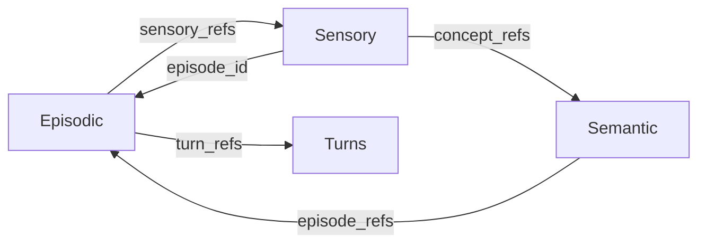

# MSP Master Specification (v0.1.1)

> **Module:** Memory & Soul Passport (MSP)
> **Status:** Current Standard
> **Architecture:** File-per-Record (ADR-005)

---

## 1. Overview
MSP is the unified memory system for EVA. It manages three types of memories:
1. **Episodic**: Autobiographical experiences (conversations, events).
2. **Semantic**: Factual knowledge (Subject-Predicate-Object).
3. **Sensory**: Raw perceptual data and Qualia (subjective experience).

### 🔄 Memory Crosslinks (ADR-Pending)
Bidirectional linking allows the system to traverse from raw data to meaning and back.



---

## 2. Episodic Memory Schema (V3)
Stored in `memory/episodes/`. Each file contains metadata and references to turns.

### 2.1 EpisodicMemory Fields
| Field | Type | Description | Example |
|-------|------|-------------|---------|
| `episode_id` | `str` | Unique ID of the episode | `EP_20260128_001` |
| `turn_refs` | `List[str]` | IDs of turns (TU/TL) | `["TU_001", "TL_001"]` |
| `sensory_refs` | `List[str]` | IDs of sensory records | `["SMEM_001"]` |
| `persona_id` | `str` | Which "ร่าง" of EVA | `EVA_01` |
| `event_id` | `str` | Grouping ID for series of episodes | `resume_writing_trip` |
| `situation_context` | `Obj` | Environmental/Contextual metadata | See Section 2.2 |
| `summary` | `Obj` | Deeply structured summary | See Section 2.3 |
| `workflow_state` | `Obj` | Internal task tracking | See Section 2.4 |

### 2.2 SituationContext (The "Why" & "Where")
Prevents AI from using wrong "mode" or "tone".
- `interaction_mode`: `casual` vs `deep_discussion`.
- `location_context`: `mobile_ssh` (Short answers) vs `local_dev` (Detailed code).
- `agent_role`: `Senior Dev` vs `Friend` (Consistent personality).
- `mission_goal`: `Apply for jobs` (Keeps AI on target).

### 2.3 StructuredSummary (The "Impact")
- `action_taken`: "Analyzed user's portfolio" (What happened).
- `key_outcome`: "Selected Inter font" (What was decided).
- `future_implication`: "Must update CSS in next turn" (What to do next).

### 2.4 WorkflowState (The "Task Tracker") [New v0.2.1]
Tracks the agent's internal progress within a mission.
- `current_task`: The specific item being worked on right now.
- `completed_items`: List of tasks finished in this session/mission.
- `pending_items`: List of tasks remaining to achieve the `mission_goal`.

---

## 3. Turn Schema (Standalone)
Stored in `memory/turns/user/` and `memory/turns/llm/`.

### 3.1 TurnUser (What the user said)
- `text_excerpt`: The actual text of the user.
- `emotion_signal`: `joy`, `frustration`, etc.
- `salience_anchor`: Key words like `sushi`, `Python`.

### 3.2 TurnLLM (What EVA answered)
- `text_excerpt`: The response excerpt.
- `epistemic_mode`: `assert` (Fact), `reflect` (Thinking), `hypothesize` (Guess).
- `confidence`: certainty level (0.0-1.0).

---

## 4. Semantic Memory Schema (The "Facts")
Stored in a graph-ready format.

| Field | Description | Example |
|-------|-------------|---------|
| `subject` | The entity | `User (Freshair)` |
| `predicate` | The relationship | `likes` |
| `object` | The target value | `Sushi` |
| `episode_refs` | Evidence links | `["EP_001"]` |
| `confidence` | How sure are we? | `0.95` |

---

## 5. Sensory Memory Schema (v1)
Stored in `memory/turns/sensory/`. Captures "Qualia" (the feeling of now).

### 5.1 SensoryMemory Fields
| Field | Type | Description | Example |
|-------|------|-------------|---------|
| `sensory_id` | `str` | Unique ID | `SMEM_20260129_001` |
| `episode_id` | `str` | Link to Episode (Source) | `EP_20260128_001` |
| `data_type` | `str` | format | `image`, `audio`, `visual_pattern` |
| `qualia` | `Obj` | Subjective experience | See 5.2 |
| `concept_refs` | `List[str]` | Extracted Semantic facts | `["sem_abc123"]` |
| `physio_snapshot` | `Dict` | Hormones at time T | `{"dopamine": 0.5, ...}` |

### 5.2 Qualia (Phenomenology)
- `color_hex`: Dominant "color" of the feeling (e.g., `#E6E6FA`).
- `texture`: Texture of thought (`smooth`, `sharp`, `liquid`).
- `soundscape`: Passive sound context (`white_noise`, `serene`).
- `intensity`: Strength of the experience (0.0 - 1.0).

---

## 6. Prevention of Hallucination (Guide for Agent)
**CRITICAL RULES:**
1. **Never Assume Intent**: If `intent` is missing in `TurnUser`, infer from `text_excerpt` only if high confidence.
2. **Context Honor**: If `location_context` is `mobile_ssh`, **NEVER** output more than 2-3 lines of code unless explicitly asked.
3. **Role Lock**: If `agent_role` is `Senior Dev`, the `epistemic_mode` in the next `TurnLLM` should lean towards `assert` or `caution`.
4. **Summary Loyalty**: When summarizing, the `future_implication` must be traceable to the `key_outcome`.
5. **Qualia Consistency**: If `SensoryMemory` shows `intensity: 0.9` and `texture: sharp`, the `TurnLLM` response should be concise and direct, reflecting an "alert" state.

---

## 7. Example JSON (Episodic)
```json
{
  "episode_id": "EP_001",
  "turn_refs": ["TU_001", "TL_001"],
  "situation_context": {
    "location_context": "mobile_ssh",
    "agent_role": "Senior Dev",
    "mission_goal": "Refactor MSP"
  },
  "summary": {
    "action_taken": "Proposed File-per-Record architecture",
    "key_outcome": "User approved the change",
    "future_implication": "Redesign episodic.py"
  },
  "workflow_state": {
    "current_task": "Update episodic schema",
    "completed_items": ["Research ADR-005"],
    "pending_items": ["Update verify_episodic.py", "Commit changes"]
  }
}
```

---

## 8. Example JSON (Sensory)
```json
{
  "sensory_id": "SMEM_001",
  "episode_id": "EP_001",
  "data_type": "visual_pattern",
  "qualia": {
    "color_hex": "#E6E6FA",
    "texture": "soft",
    "intensity": 0.8
  },
  "physio_snapshot": {
    "dopamine": 0.7
  }
}
```

---

*Signed: Antigravity*
